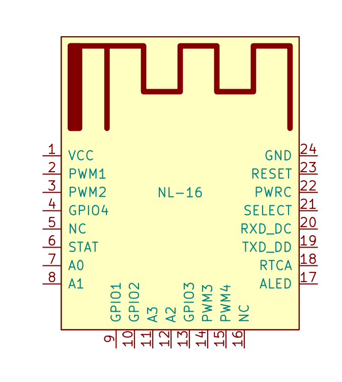

**# 关于本手册**

​		本文档为NL-16蓝牙4.2模组AT指令说明文档

**修改历史**

----

**日期**                            **版本**                                    **发布说明**

------

2021.8.21                   V1.0                                   首次发布

------

------

[产品介绍](#产品简介)

[模块参数](#模块参数)

[引脚说明](#引脚说明)

[NL-16和手机连接](#NL-16和手机连接)

[AT指令集](#AT指令一览表)

[AT指令集详细说明](#AT指令集详细说明)

[常见问题](#常见问题)

## 产品简介

NL-16 透传模块是基于蓝牙 4.2 协议标准，工作频段为 2.4GHZ 范围，调制方式为 GFSK，最大发射功率为 0db，最大发射距离 60 米，采用进口原装芯片设计，支持用户通过 AT 命令修改设备名、服务 UUID、发射功率、配对密码等指令，方便快捷使用灵活。
NL-16 蓝牙模块可以实现模块与手机或模块与模块数据传输，可通过 IO 选择 UART 或IIC 通信方式，通过简单的配置即可快速使用 BLE 蓝牙进行产品应用

## 模块参数

-   型号：NL-16
-   芯片：XC620T
-   蓝牙版本：BLE4.2(兼容4.0，4.1)
-   工作频道： 2.4G
-   发射功率：0db(最大)
-   通讯接口：UART 默认波特率9600
-   工作电压：1.8V - 3.6V
-   工作温度：-4 ~ 80
-   接收灵敏度：-97dbm
-   传输距离：空旷60米
-   透传速率：最大115200bps/s
-   唤醒电流：4mA
-   浅睡电流：<300uA
-   深睡电流：<300uA
-   尺寸： 19.6mm x 14.9mm x 1.0mm
-   SMT焊接温度： <300度

## 引脚定义

## NL-16测试

### NL-16和android手机测试

### NL-16和IOS/MAC设备测试

ios手机和mac电脑我们测试方法是一样的，应用商店下载lightblue这个应用

### NL-16和windows10设备

## AT指令一览表

NL-16透传模块指令是通过串口发送，波特率支持9600,19200,38400,57600,115200。串口默认波特率为9600bps。

（注：发AT指令时必须回车换行， AT指令只能在模块未连接状态下才能生效，一旦蓝牙模块与设备连接上，蓝牙模块即进入数据透传模式。AT指令区分大小写，均以回车换行字符结尾：\\r\\n）

| 指令             | 描述                             | 主(Master)/从(Slave) | 工作模式 | 默认      |
| ---------------- | -------------------------------- | -------------------- | -------- | --------- |
| AT               | 测试                             | M/S                  |          |           |
| AT+ALL           | 打印所有得配置信息               | M/S                  |          |           |
| AT+RESET         | 复位蓝牙模块                     | M/S                  |          |           |
| AT+VER           | 查询模块固件版本                 | M/S                  |          |           |
| AT+BAUD          | 设置模组串口波特兰               | M/S                  |          | 9600      |
| AT+ROLE          | 设置蓝牙主从模式                 | M/S                  |          | Slave从机 |
| AT+NAME          | 设置蓝牙名字                     | S                    |          | NL-16     |
| AT+MAC           | 设置查看模组蓝牙12位mac地址      | M/S                  |          | 随机      |
| AT+AUTH          |                                  |                      |          |           |
| AT+PASS          | 设置模组蓝牙连接密码             | S                    |          |           |
| AT+SCAN          | 扫描周边的蓝牙设备               | M                    |          | /         |
| AT+CONN          | 连接扫描结果对应下标的蓝牙       | M                    |          |           |
| AT+CON           | 连接对应Mac地址得蓝牙            | M                    |          |           |
| AT+AUTOCON       | 自动连接最近的从机蓝牙，重启生效 | M                    |          | 0         |
| AT+DISCON        | 断开当前的连接                   | M                    |          |           |
| AT+MODE          | 设置蓝牙工作模式                 | M/S                  |          | 0         |
| AT+SRVUUID       | 设置/获取蓝牙服务特征码SRVUUID   | M/S                  |          | 0xFFE0    |
| AT+CHARUUID      | 设置/获取蓝牙字符特征码CHARUUID  | M/S                  |          | 0xFFE1    |
| AT+MINI_INTERVAL | 设置BLE芯片最小通信间隔          | M/S                  |          | 6         |
| AT+MAX_INTERVAL  | 设置BLE芯片最大通信间隔          | M/S                  |          | 6         |
| AT+TXPOWER       | 设置蓝牙发射功率                 | M/S                  |          | 0         |
| AT+RXGAIN        | 设置BLE接收增益                  | M/S                  |          | 1         |
| AT+SETTING       | 系统设置                         | M/S                  |          |           |
|                  |                                  |                      |          |           |

## AT指令集详细说明

AT—测试指令

| 指令| AT   |
| :-: | :--- |
|   响应 | OK   |
| 参数说明 | -    |

AT+ALL—打印所有配置信息

|   指令   | AT+ALL |
| :------: | :----- |
|   响应   | OK     |
| 参数说明 | -      |

AT+RESET—复位模组

|   指令   | AT+RESET |
| :------: | :------- |
|   响应   | OK       |
| 参数说明 | -        |

AT+VER—查询模组固件版本

|   指令   | AT+VER                                   |
| :------: | :--------------------------------------- |
|   响应   | <AT version> <compile time> OK |
| 参数说明 |                                          |

AT+BAUD—查询设置模组的串口通讯波特率

|   指令   | AT+BAUD                        |
| :------: | :----------------------------- |
|   响应   | OK                             |
| 参数说明 | 支持9600，19200，38400，115200 |

AT+NAME—查询设置模组蓝牙设备名字

|   指令   | AT+NAME<device name>             |
| :------: | :------------------------------- |
|   响应   | OK                               |
| 参数说明 | <AT version> <compile time> |

AT+NAME—查询设置模组蓝牙设备名字

|   指令   | AT+MAC |
| :------: | :----- |
|   响应   | OK     |
| 参数说明 | -      |

## 常见问题

**问：NL-16和HR-05蓝牙模组有何区别**

**问：NL-16和其他5蓝牙模组相比有何优势**

1、完善的AT指令支持，功能齐全可以更灵活应用

2、除了串口AT支持，还支持蓝牙配置

**问：常见的蓝牙4.0之间通信不正常的问题。**

答：建议检查步骤：

1 更新固件至最新版本；

2 通过AT指令恢复出厂设置 (AT+SETTING=DEFAULT). （详见:通过AT指令配置BLE设备 ）

3 检查蓝牙模块、程序代码等相关地方的通信波特率是否一致，检查使用的USB转micro数据线是否能正常工作，板子上的USB红色灯是否正常亮起。

4.配对蓝牙设备是否支持4.0，还有CC2540和其他品牌蓝牙模组会存在兼容性问题，使用尽可能和CC25xx系类蓝牙模块连接

**问：为什么我的手机连不上NL-16，即使可以连上，但也不能通信？**

答：请检查您的手机是否支持蓝牙4.0。另外，请使用APP内的Scan按钮扫描连接NL-16，连接不需要密码。不支持手机蓝牙设置界面、其他BLE APP连接。

**问：如何使用Ibeacon功能？**

答：您可以在AT列表里找到相关指令开启/关闭Ibeacon功能，然后在应用市场上下载一款Ibeacon查询软件，就可以查询Ibeacon了，这时候Bluno就是一个Ibeacon标签。

**问：NL-16支持多联吗？我想用一个主机连接很多从机，请问最多能连几个？**

答：NL-16不支持多联，但是可以通过不断地切换绑定从机，实现多联的思想。

**问：为什么NL-16系列的蓝牙4.0产品无法连接蓝牙2.0的设备？**

答：由于我们的NL-16系列为了实现极低的功耗，采用了单模蓝牙低功耗（Bluetooth Smart），硬件和软件上都做了优化，只能支持BLE，不支持连接蓝牙2.0设备。
